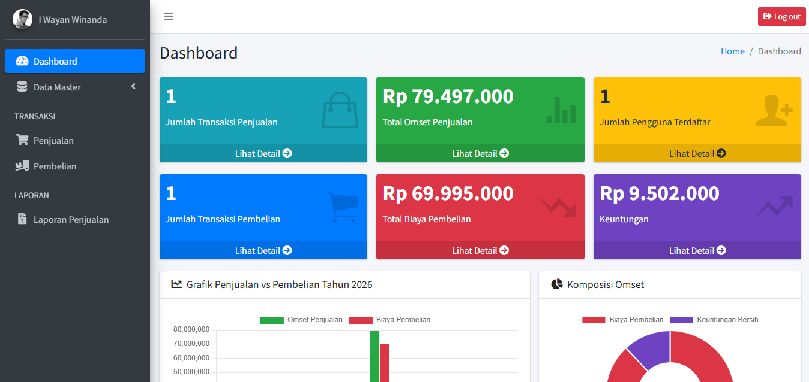
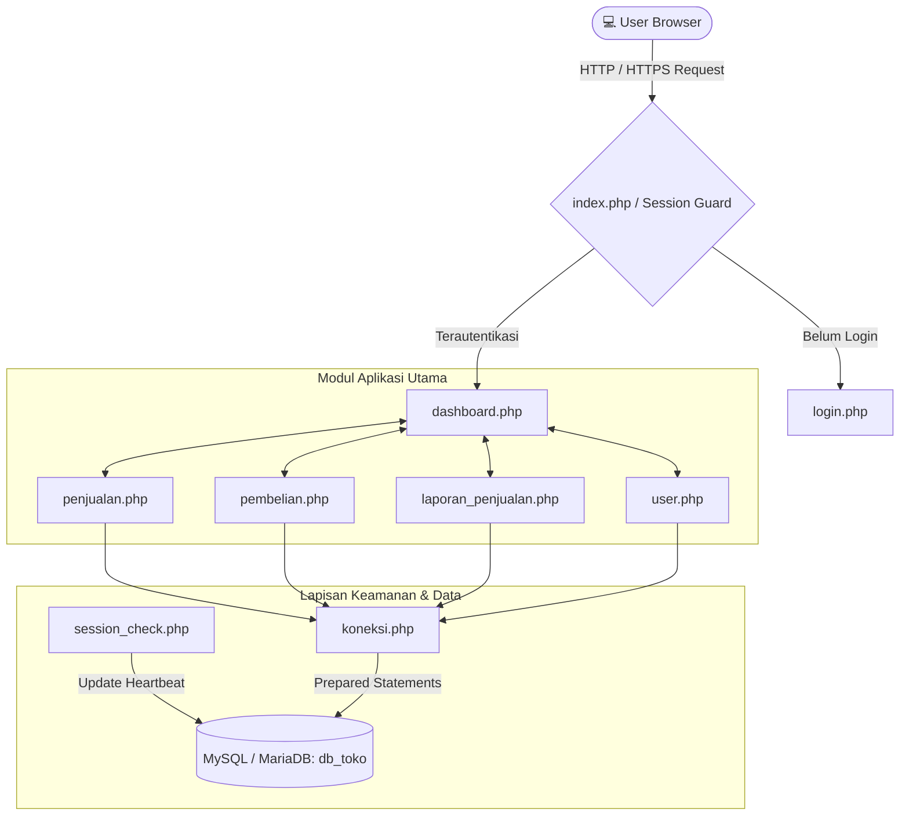
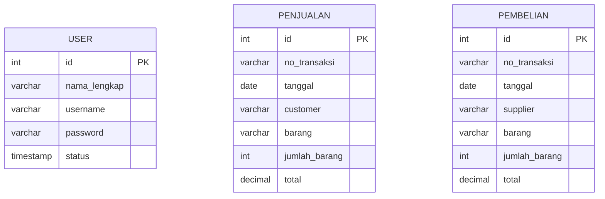

<div align="center">

# 📱 Phone Store CRUD Management System
### *Sistem Informasi Manajemen Inventaris & Transaksi Retail Smartphone Terintegrasi Berbasis Web*



<p align="center">
  <b>Solusi all-in-one untuk administrasi penjualan, pengadaan stok, pemantauan omset real-time, dan audit laporan keuangan toko ponsel.</b>
</p>

[](https://www.php.net/)
[](https://www.mysql.com/)
[](https://adminlte.io/)
[](https://getbootstrap.com/)
[](https://www.chartjs.org/)
[](LICENSE)

</div>

## 📌 Tentang Proyek

**Phone Store CRUD** adalah aplikasi sistem informasi berbasis web yang dikembangkan untuk mendigitalisasi dan mengotomatisasi seluruh proses operasional retail smartphone. Sistem ini menggantikan pencatatan manual buku kas konvensional dengan platform terpusat yang aman, cepat, dan terstruktur.

Aplikasi ini mencakup siklus lengkap bisnis retail mulai dari **manajemen pengguna dan autentikasi aman**, **pembelian barang dari supplier (procurement)**, **pencatatan transaksi kasir penjualan ke pelanggan**, hingga **rekapitulasi analitik grafik pendapatan dan cetak laporan PDF/cetak fisik siap audit**.

---

## ✨ Fitur Utama

<table>
  <tr>
    <td width="50%">
      <h3>📊 1. Executive Analytics Dashboard</h3>
      <ul>
        <li><b>Statistik KPI Real-Time</b>: Total transaksi penjualan, total omset kotor, pengeluaran pembelian, dan margin laba/keuntungan bersih otomatis.</li>
        <li><b>Visualisasi Chart.js</b>: Grafik batang komparasi bulanan antara omset penjualan vs biaya pembelian pada tahun berjalan.</li>
        <li><b>Donut Chart Distribusi</b>: Visualisasi proporsi dan kesehatan rasio finansial toko.</li>
      </ul>
    </td>
    <td width="50%">
      <h3>💰 2. Manajemen Penjualan (Sales POS)</h3>
      <ul>
        <li><b>Continuous Auto Invoice Generator</b>: Pembuatan nomor transaksi unik berurutan secara global berbasis tanggal (e.g. <code>TRJ-YYYYMMDD-XXXX</code>) yang mencegah duplikasi nomor invoice.</li>
        <li><b>Currency Auto-Masking</b>: Input nominal dengan pemisah ribuan Rupiah otomatis secara interaktif saat mengetik maupun paste.</li>
        <li><b>CRUD Interaktif</b>: Tambah, ubah data, dan hapus transaksi dengan modal konfirmasi.</li>
      </ul>
    </td>
  </tr>
  <tr>
    <td width="50%">
      <h3>🛒 3. Manajemen Pembelian (Procurement)</h3>
      <ul>
        <li><b>Kode Transaksi Masuk Otomatis</b>: Penomoran terstandarisasi untuk transaksi pembelian unit stok (e.g. <code>TRB-YYYYMMDD-XXXX</code>) dengan counter berurutan otomatis.</li>
        <li><b>Tracking Supplier & Stok</b>: Pencatatan identitas distributor/supplier, tipe unit ponsel, kuantitas, dan total biaya modal.</li>
        <li><b>Pencarian & Filtering Cepat</b>: Didukung oleh jQuery DataTables dengan pagination dan live search instan.</li>
      </ul>
    </td>
    <td width="50%">
      <h3>📄 4. Laporan & Print-Ready Engine</h3>
      <ul>
        <li><b>Custom Date Range Filter</b>: Fleksibilitas memilih rentang tanggal awal dan akhir transaksi.</li>
        <li><b>Auto-Aggregate Calculation</b>: Perhitungan otomatis total omset pada footer tabel laporan.</li>
        <li><b>Print & Export PDF Support</b>: Optimasi CSS <code>@media print</code> yang secara otomatis menyembunyikan navigasi dan sidebar untuk cetak dokumen resmi yang bersih.</li>
      </ul>
    </td>
  </tr>
  <tr>
    <td width="50%">
      <h3>👥 5. Manajemen Pengguna & Keamanan</h3>
      <ul>
        <li><b>Autentikasi Session Guard</b>: Proteksi seluruh modul dari akses tanpa hak otorisasi login.</li>
        <li><b>Live Presence / Online Tracking</b>: Indikator status aktif pengguna dengan deteksi heartbeat interval 5 menit.</li>
        <li><b>Password Hashing</b>: Enkripsi kredensial pengguna menggunakan algoritma <code>BCRYPT</code> standar industri.</li>
      </ul>
    </td>
    <td width="50%">
      <h3>🎨 6. Antarmuka Modern & Responsif</h3>
      <ul>
        <li><b>AdminLTE 3 UI</b>: Tampilan dashboard yang elegan, intuitif, dan ramah pengguna.</li>
        <li><b>Responsive Design</b>: Penyesuaian layout optimal untuk perangkat Desktop, Tablet, maupun Smartphone.</li>
        <li><b>Modular Tables</b>: Komponen tabel interaktif lengkap dengan fitur sorting, search, dan pagination.</li>
      </ul>
    </td>
  </tr>
</table>

---

## 🏗️ Arsitektur Sistem

Sistem dibangun menggunakan paradigma **Monolithic MVC-lite** dengan PHP Native yang bersih, terstruktur, dan efisien:



---

## 📊 Skema Database

Aplikasi menggunakan basis data relasional MySQL (`db_toko`) yang telah dioptimalkan dengan indeks primary key dan auto-increment:



### Kamus Data

#### 1. Tabel `user`
Menyimpan kredensial dan status aktivitas operator/admin sistem.

| Kolom | Tipe Data | Keterangan |
| :--- | :--- | :--- |
| `id` | `INT(11)` | Primary Key, Auto Increment |
| `nama_lengkap` | `VARCHAR(50)` | Nama lengkap pengguna / administrator |
| `username` | `VARCHAR(50)` | Username unik untuk otentikasi login |
| `password` | `VARCHAR(255)` | Hash password terenkripsi BCRYPT |
| `status` | `TIMESTAMP` | Timestamp aktivitas terakhir (Heartbeat online status) |

#### 2. Tabel `penjualan`
Menyimpan log transaksi penjualan produk ponsel ke pelanggan.

| Kolom | Tipe Data | Keterangan |
| :--- | :--- | :--- |
| `id` | `INT(11)` | Primary Key, Auto Increment |
| `no_transaksi` | `VARCHAR(50)` | Format kode transaksi: `TRJ-YYYYMMDD-XXXX` |
| `tanggal` | `DATE` | Tanggal terjadinya transaksi |
| `customer` | `VARCHAR(255)` | Nama pembeli / pelanggan |
| `barang` | `VARCHAR(255)` | Nama tipe/merk unit ponsel yang terjual |
| `jumlah_barang` | `INT(11)` | Kuantitas unit yang dibeli |
| `total` | `DECIMAL(15,2)` | Total nilai pembayaran (Rupiah) |

#### 3. Tabel `pembelian`
Menyimpan log pengadaan unit stok ponsel dari supplier.

| Kolom | Tipe Data | Keterangan |
| :--- | :--- | :--- |
| `id` | `INT(11)` | Primary Key, Auto Increment |
| `no_transaksi` | `VARCHAR(25)` | Format kode transaksi: `TRB-YYYYMMDD-XXXX` |
| `tanggal` | `DATE` | Tanggal pengadaan stok |
| `supplier` | `VARCHAR(100)` | Nama distributor / supplier vendor |
| `barang` | `VARCHAR(100)` | Tipe / seri unit barang yang dibeli |
| `jumlah_barang` | `INT(11)` | Jumlah unit barang masuk |
| `total` | `DECIMAL(15,2)` | Total biaya pengeluaran modal |

---

## 🛠️ Teknologi & Dependensi

| Layer | Teknologi | Deskripsi |
| :--- | :--- | :--- |
| **Backend Engine** | [PHP 8.x Native](https://www.php.net/) | Eksekusi server-side dengan `mysqli` prepared statements |
| **Database** | [MySQL](https://www.mysql.com/) / [MariaDB](https://mariadb.org/) | Penyimpanan data relasional dengan engine InnoDB |
| **Admin Template** | [AdminLTE v3](https://adminlte.io/) | Framework UI dashboard modern berbasis Bootstrap 4 |
| **CSS Framework** | [Bootstrap 4.6](https://getbootstrap.com/) | Grid system fleksibel dan komponen antarmuka responsif |
| **Charts** | [Chart.js v3+](https://www.chartjs.org/) | Visualisasi grafik batang omset dan grafik donat keuntungan |
| **DataTables** | [jQuery DataTables](https://datatables.net/) | Manajemen tabel dinamis (pencarian, sorting, pagination) |
| **Icon Pack** | [FontAwesome 5](https://fontawesome.com/) & [Ionicons](https://ionic.io/ionicons) | Set ikon vektor modern untuk navigasi dan aksi |
| **Security** | `password_hash()` & `htmlspecialchars()` | Mitigasi risiko XSS dan keamanan otentikasi data |

---

## 📂 Struktur Direktori Project

```text
phone-store-crud/
├── dist/                      # Asset statis hasil compile AdminLTE (CSS, JS, Images)
│   ├── css/adminlte.min.css   # Main stylesheet
│   ├── img/                   # Gambar avatar, ilustrasi, dan icon sistem
│   └── js/adminlte.min.js     # Script inti interaktivitas AdminLTE
├── docs/                      # Dokumentasi sistem & screenshot preview
│   └── assets/img/            # Tangkapan layar antarmuka aplikasi
├── plugins/                   # Library pihak ketiga pendukung
│   ├── bootstrap/             # Bootstrap 4 bundle JS & CSS
│   ├── datatables/            # Core library DataTables
│   ├── datatables-bs4/        # Integrasi styling DataTables untuk Bootstrap 4
│   ├── fontawesome-free/      # FontAwesome icons set
│   ├── icheck-bootstrap/      # Styling input form login
│   └── jquery/                # jQuery framework core
├── dashboard.php              # Halaman beranda analitik & visualisasi grafik
├── db_toko.sql                # Skema database DDL & data seed awal
├── index.php                  # Gerbang redirector otentikasi
├── koneksi.php                # Konfigurasi koneksi database MySQLi
├── laporan_penjualan.php      # Modul filter laporan & export/print transaksi
├── login.php                  # Antarmuka & pemrosesan login aman
├── logout.php                 # Terminasi session & reset status user
├── pembelian.php              # Modul CRUD transaksi pembelian stok
├── penjualan.php              # Modul CRUD transaksi penjualan unit
├── session_check.php          # Middleware proteksi halaman & status tracker
├── user.php                   # Modul CRUD manajemen data akun administrator
├── .gitattributes             # Konfigurasi normalisasi line endings & linguist GitHub
├── .gitignore                 # Aturan pengabaian file sampah, cache, & OS temporary
└── README.md                  # Dokumentasi resmi repositori
```

---

## 🚀 Panduan Instalasi & Setup

Ikuti panduan langkah demi langkah berikut untuk menjalankan project ini pada environment lokal (XAMPP / Laragon / WampServer):

### 1. Prasyarat Sistem
Pastikan perangkat Anda telah terinstal software berikut:
- **Web Server**: Apache (XAMPP / Laragon / Nginx)
- **PHP**: Versi 7.4 atau 8.x (Direkomendasikan PHP 8.1 / 8.2)
- **Database Server**: MySQL 5.7+ atau MariaDB 10.4+
- **Web Browser**: Google Chrome, Mozilla Firefox, Microsoft Edge, atau Safari

---

### 2. Clone Repositori
Buka terminal / Git Bash di folder `htdocs` (jika menggunakan XAMPP) atau `www` (jika menggunakan Laragon):

```bash
# Pindah ke direktori htdocs XAMPP
cd C:/xampp/htdocs

# Clone repositori
git clone https://github.com/winanda150/phone-store-crud.git

# Masuk ke direktori project
cd phone-store-crud
```

---

### 3. Setup Basis Data (Database)
1. Buka control panel XAMPP dan pastikan modul **Apache** dan **MySQL** dalam status **Running**.
2. Akses **phpMyAdmin** melalui browser di: `http://localhost/phpmyadmin`
3. Buat database baru dengan nama: `db_toko`
4. Pilih database `db_toko`, klik tab **Import**.
5. Pilih file `db_toko.sql` yang berada di root folder project, lalu klik **Import / Kirim**.

---

### 4. Konfigurasi Koneksi Database
Buka file `koneksi.php` pada text editor favorit Anda, lalu sesuaikan konfigurasi kredensial database lokal:

```php
<?php
$host = "localhost";
$user = "root";       // Username database Anda (default: root)
$pass = "";           // Password database Anda (default kosong di XAMPP)
$db   = "db_toko";     // Nama database yang diimport

$conn = mysqli_connect($host, $user, $pass, $db);

if (!$conn) {
    die("Koneksi gagal: " . mysqli_connect_error());
}
?>
```

---

### 5. Akses Aplikasi
Buka web browser dan akses URL berikut:

```text
http://localhost/phone-store-crud
```

## 🔐 Fitur Keamanan Aplikasi

Aplikasi ini telah dilengkapi dengan serangkaian standar keamanan aplikasi web dasar:

1. **SQL Injection Prevention**: Seluruh operasi query sensitif (otentikasi login, insert data, edit data, dan delete data) menggunakan **Prepared Statements & Parameterized Binding** (`$conn->prepare()` dan `$stmt->bind_param()`).
2. **Cross-Site Scripting (XSS) Mitigation**: Seluruh output dinamis dari database di-escape dengan fungsi bawaan `htmlspecialchars()` untuk mencegah eksekusi skrip berbahaya.
3. **Password Security**: Menggunakan algoritma hash modern standar PHP `password_hash()` dan verifikasi dengan `password_verify()`.
4. **Session Guard Middleware**: Memeriksa validitas sesi aktif pada setiap halaman melalui `session_check.php`. Akses ilegal tanpa login otomatis dialihkan ke `login.php`.
5. **Real-time Heartbeat & Active State**: Mengidentifikasi sesi aktif dan memperbarui timestamp aktivitas terakhir pengguna secara otomatis.

---

## 🗺️ Routing & Navigasi Halaman

| Halaman | File | Fungsi & Deskripsi |
| :--- | :--- | :--- |
| **Gate / Index** | `index.php` | Mengarahkan user yang sudah login ke dashboard atau ke halaman login |
| **Login** | `login.php` | Halaman otentikasi akun pengguna |
| **Dashboard** | `dashboard.php` | Ringkasan metrik statistik toko dan grafik finansial Chart.js |
| **Data User** | `user.php` | Manajemen akun staff/admin dan pemantau status online |
| **Penjualan** | `penjualan.php` | Transaksi kasir penjualan unit smartphone ke pelanggan |
| **Pembelian** | `pembelian.php` | Transaksi pengadaan stok unit dari distributor/supplier |
| **Laporan** | `laporan_penjualan.php` | Rekapitulasi transaksi berdasarkan rentang tanggal & cetak struk/laporan |
| **Logout** | `logout.php` | Penghapusan sesi aktif dan pengalihan ke halaman login |

---

## 🤝 Kontribusi

Kontribusi selalu disambut dengan senang hati! Jika Anda memiliki ide perbaikan atau fitur baru:

1. **Fork** repositori ini (`https://github.com/winanda150/phone-store-crud/fork`).
2. Buat branch fitur baru (`git checkout -b feature/FiturKerenAnda`).
3. Commit perubahan Anda (`git commit -m 'Menambahkan Fitur Keren'`).
4. Push branch Anda (`git push origin feature/FiturKerenAnda`).
5. Buat **Pull Request** baru.

---

## 👨‍💻 Pengembang

**I Wayan Winanda**
- **GitHub**: [@winanda150](https://github.com/winanda150)
- **Project**: Phone Store CRUD Management System (Project UAS Pemrograman Web)

---

<div align="center">
  <small>Made with ❤️ by <b>WinandaDev</b> • &copy; 2026 All Rights Reserved</small>
</div>